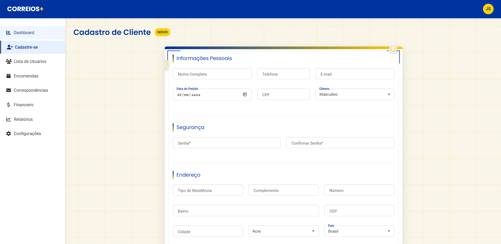
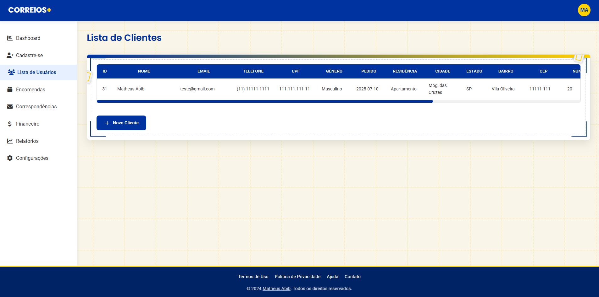
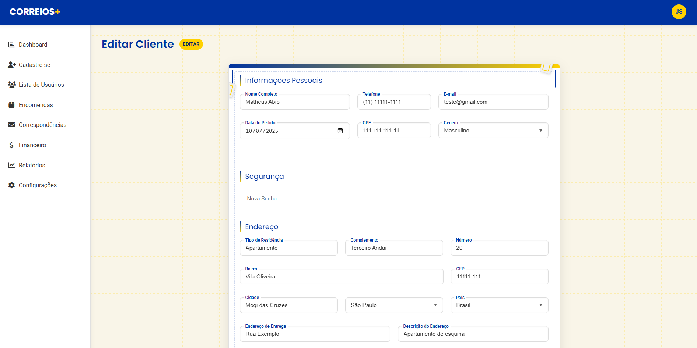
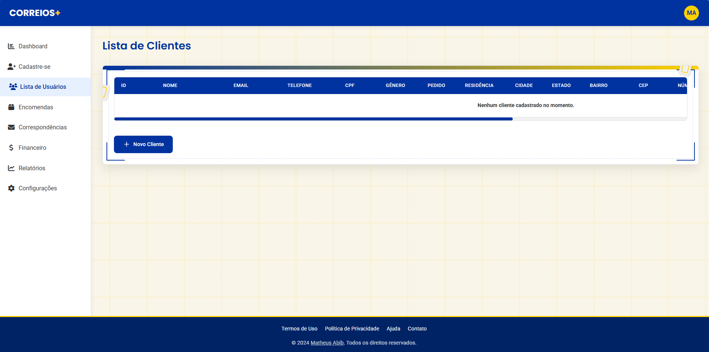
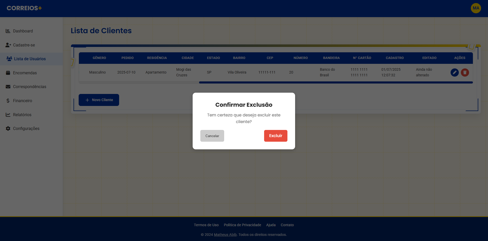

# 📦 Sistema de Gerenciamento de Clientes - Correios+

<<<<<<< HEAD
 
 
 
 
 

=======

>>>>>>> recuperar-antigo

---

## 🌟 Visão Geral

Sistema completo para gerenciamento de clientes desenvolvido para os **Correios**, com interface intuitiva e funcionalidades avançadas de **CRUD**: **Adicionar, Editar, Visualizar e Excluir**.

---

## 🚀 Funcionalidades

- ✅ **Cadastro completo de clientes**  
- ✏️ **Edição em tempo real**  
- 🗑️ **Exclusão segura com confirmação**  
- 📊 **Visualização de dados em tabela dinâmica**  
- 📱 **Design responsivo**  

---

## 💻 Tecnologias Utilizadas

   
   
  
   
   

---

